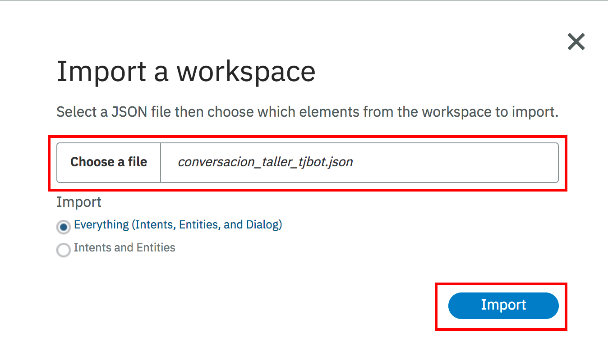

# Receta de proyecto TJBot ajustado para México #

Este es un proyecto en Node.js para demostrar las funcionalidades básicas de TJBot que incluyen: ver, 
escuchar, hablar, bailar, etc.

Para utilizar el presente proyecto en nuestro TJBot, debemos primero clonar este repositorio a nuestro __TJBot__ por lo tanto desde una ventana de terminal en nuestro robót, ejecutaremos la clonación de la siguiente manera:

```
git clone https://github.com/marmotae/tjbot-ibm-mexico.git

```
Esto bajará los archivos de proyecto necesarios restando tan solo bajar las bibliotecas adicionales de las dependencias. Para hacer esto, usamos la herramienta __npm__ de la siguiente forma desde nuestra línea de comando del __TJBot__

```
npm install 
```
El proceso tomará unos minutos en lo que baja el código fuente necesario y lo compila

> Nota: En ocasiones es necesario trabajar con versiones modificadas de las bibliotecas. Esto es una acción para usuarios mas avanzados. Si tienes esta necesidad, puedes ver como hacerlo [aquí](README_LOCAL_LIBRARY.md)

## Configuración de los servicios ##

La configuración de los distintos servicios se hace mediante un archivo de configuración. Se ha integrado un archivo que puede ser usado como punto de partida. Para crearlo, copiemos el archivo muestra a el archivo definitivo de la siguiente forma:

```
cp config.default.js config.js 
```

Existen tres servicios básicos a configurar :
* __Watson Assistant__ que se encargará de administrar el díalogo con el usuario.
* __Speech to Text__ que se encargará de convertir las frases habladas por el usuario en texto.
* y __Text to Speech__ que se encargará de convertir las respuestas en texto generadas por __Watson Assistant__ en voz

Por lo tanto, antes de continuar debemos ir a [IBM Cloud](http://www.bluemix.net) a crear una cuenta y generar los tres servicios.

### Configuración del Watson Assistant ###
El díalogo de nuestro __TJBot__ es controlado y orquestado por el servicio __Watson Assistant__ por lo tanto debemos de configurar el servicio. El primer paso consiste en crear un díalogo, tambien conocido como un __workspace__

Una vez creado el servicio de __Watson Assistant__, debemos entrar a su panel de administración y en la sección __Manage__ damos click sobre el botón para invocar la herramienta de gestión del __Watson Assistant__


Esto nos lleva a la página de bienvenida para el __Watson Assistant__, una vez ahí debemos seleccionar en el menú superior izquierdo la opción marcada como `Workspaces`para poder crear nuestro espacio de trabajo del díalogo


Una vez que estamos dentro de la sección de `Workspaces`tenemos la opción de crear uno desde cero, sin embargo en nuestro caso, tenemos un archivo previamente creado que importaremos. Para esto debemos hacer click en el botón de importación de archivos


Esto nos mostrará una ventana de dialogo para elegir un archivo mismo que se encuentra entre los archivos clonados de nuestro repositorio. Navegamos a la ruta `resources` y ahí seleccionamos el archivo normbrado `conversacion_taller_tjbot.json` para finalmente importarlo como se muestra a continuación:



Al terminar de importar el workspace, se nos transfiere a la pantalla de edición, sin embargo ahora necesitamos regresa a la sección de `Workspaces`para obtener un dato. Por lo tanto en el menú del lado izquerdo seleccionamos el último boton


Una vez que nos encontramos en la sección de `Workspaces`debemos tomar la tarjeta correspondiente al taller y dando click en el menú superior derecho, seleccionamos la opción `View details``


La tarjeta girará mostrándonos los detalles. Aquí la parte importante es el `Worspace ID`que procedemos a copiar, dando click en el ícono mostrado a continuación


 Ahora debemos usar ese número en la sección correspondiente de nuestro archivo de configuración `config.js`. Abriendo ese archivo debemos encontrar la siguiente sección

 ```
 /**
 * Creación de los elementos de conversación con el Watson Assistant
 */

// Primero creamos y configuramos el identificador de workspace a usar con Assistant
exports.assistantWorkspaceId = ''; 

 ```
Pegaremos el valor de `WorkspaceId` entre las commilas que aparecen al lado de la frase assistantWorkspaceId.

Ahora procederemos a copiar las credenciales. De regreso en nuestra sección de administración de servicio en __IBM Cloud__ podemos encontrar la sección de credenciales para nuestro servicio. Si esta sección aparece con una serie de `•••••••••••`esto quiere decir que los valores se encuentran ocultos por lo que presionaremos el boton `Show`que aparece en la parte superior derecha. 


En el caso que aparece anteriormente, este servicio tiene cartas credenciales a manera de username/password. Dependiendo del servicio y de su fecha de creación inicial, es posible que encontremos un servicio en donde en lugar de esto se nos muestre una llave de API como en el caso siguiente


Ahora deberemos copiar el valor a valores correspondientes para ponerlos en nuestro arvhico de configuracion `config.js` dentro de la variable `exports.credentials.assistant`. Asumiendo que el servicio muestra confirguración mediante username y password, nuestra configuración seguirá la siguiente forma, copiando los valores de username y password de __IBM Cloud__ y pegándolos donde corresponden en el archivo.

```
// Ahora especificamos la credenciales de uso
exports.credentials.assistant = {
	password: '',
	username: ''
};
```

En el caso contraro de que el servicio muestre un APIKey, lo configuraremos de la siguiente manera, copiando el valor de apikey que aparece en la consola de __IBM Cloud__ y pegandolo entre las comillas de la variable `iam_apikey`

```
// Ahora especificamos la credenciales de uso
exports.credentials.assistant = {
	iam_apikey: ''
};
```

### Configuración del Speech to Text ###

En este caso, luego de crear el servicio, debemos entrar en la sección de administración del mismo para copiar sus credenciales y pegar los valores correspondiente en el archivo `config.js` bajo la sección `exports.credentials.speech_to_text` como aparece a continuación, teniendo precaución en elegir ya sea el modo username y password o apikey según sea aplicable

```
/**
 * Creación de las credenciales para el servicio Speech to Text
 * que realiza la conversión de voz a texto
 */
exports.credentials.speech_to_text = {
	password: '',
	username: ''
};
```

### Configuración del Text to Speech ###

En este caso, luego de crear el servicio, debemos entrar en la sección de administración del mismo para copiar sus credenciales y pegar los valores correspondiente en el archivo `config.js` bajo la sección `exports.credentials.text_to_speech` como aparece a continuación, teniendo precaución en elegir ya sea el modo username y password o apikey según sea aplicable

```
/**
 * Creación de las credenciales para el servicio Text to Speech
 * que realiza la conversión de texto a voz
 */
exports.credentials.text_to_speech = {
	password: '',
	username: ''
};
```

### Configuración de otros sevicios ###
Los demás servicios no son esenciales para la ejecución del taller, sin embargo el archivo muestra de configuración incluye secciones para los demás servicios. La configuración es similar a la ejecutada para los servicios de  `Speech to Text` y `Text to Speech`. La descripción detallada de como usarlos se encuentra fuera del alcance del taller pero a manera de asistencia, se incorpora la siguiente tabla que muestra el servicio, la variable usada para las credenciales y una breve descripción del servicio:

Servicio            | Variable                               | Descripción
--------------------|----------------------------------------|---------------------------------------
Language Translator | exports.credentials.language_translator| Servicio de traducción entre idiomas
Visual Recognition  | exports.credentials.visual_recognition | Servicio de reconocimiento de imágenes
Tone Analizer       | exports.credentials.tone_analyzer      | Servicio de análisis de tono emocional

## Otras Configuraciones Posibles ##

### Configuración del Huso Horario ###
Algunas operaciones de conversación del asistant pueden hacer supuestos sobre la hora, sin embargo en caso de no ser especificada, __TJBot__ tomará como la hora local aquella de el Meridiano de Greenwich. Para poder ajustar la hora local, debemos especificar el Huso Horario en donde nos encontramos. Esto lo podemos especificar en el archivo `config.js` dentro de la siguiente sección

```
/**
 * Configuración del huso horario:
 * Se necesita configurar un huso horario pues en su defecto los servicios invocados desde
 * el IBM cloud ejecutarán considerando por omisión GMT.
 * 
 * Para consultar una lista completa de los husos revisar en la siguente liga
 * 
 * https://console.bluemix.net/docs/services/conversation/supported-timezones.html#time-zones-supported-by-system-entities
 * 
 */
exports.timezone = 'America/Mexico_City';

```
> Nota: En el ejemplo, hemos configurado a __TJBot__ para operar en el Huso Horario de la Ciudad de México, para consultar una lista completa de los distintos husos horarios y sus configuraciones, lo puedes hacer [aquí](https://console.bluemix.net/docs/services/conversation/supported-timezones.html#time-zones-supported-by-system-entities)

### Configuración del Nombre del Robot, la Voz, el Género y el Idioma ###
El __TJBot__ está configurado por omisión para responder al nombre de __Mago__. a hablar con una voz femenina y para entender Español. Sin embargo estos elementos pueden ser cambiados. Para cambiarlo, cualquiera de estos comportamientos, deberá editar el archivo principal de programa `tjbot.js` buscando la siguiente sección:

```
// set up TJBot's configuration
var tjConfig = {
    robot: {
    		name: 'mago',
    		gender: 'female',
    },
    listen: {
        language: 'es-ES',
        inactivity_timeout: -1
    },
    speak: {
        language: 'es-ES'
    },
```
Para modificar esta sección podemos considerar lo siguiete:

* Para cambiar el nombre del robót, debemos modificar el valor asignado a la variable `name` cambiandola de __mago__ al valor que prefiera
* Para cambiar el genero del robót, debemos modificar el valor asignado a la variable `gender` cambiandolo por ejemplo de su valor actual __female__ a __male__ por ejemplo
* Para cambiar el idioma en que por omisión escuchará el robot, debemos cambiar el valor asignado a la variable `language` dentro de la sección `listen` de __es-ES__ (Español) a otro, por ejemplo __en-US__. Para consultar una lista de los idiomas soportados, ver [aquí](https://console.bluemix.net/docs/services/speech-to-text/input.html#models)
* Para cambiar el idioma en que por omisión hablará el robot, debemos cambiar el valor asignado a la variable `language` dentro de la sección `speak` de __es-ES__ (Español) a otro, por ejemplo __en-US__. Para consultar una lista de los idiomas soportados, ver [aquí](https://console.bluemix.net/docs/services/speech-to-text/input.html#models)

> Nota: Debemos considerar que el diálogo incluido con el taller está en Español por lo que para cambiar los idomas, deberemos desarrollar un díalogo en aquel idioma selecciónado. Por otra parte, es factible que no existan ambos géneros en el idioma elegido. Por ejemplo si eligieramos bajo `speak` el idioma __es-LA__ (Español Latinoamericado) en lugar de __es-ES__ (Español de España) veríamos que la voz es forzosamente femenina ya que aún no se ha desarrollado una voz masculina para ese idioma.

### Ajustando el Hardware Usado ###
El __TJBot__ original considera además de la tarjeta madre lo siguiente:
* Un micrófono
* Una bocina
* Un diodo LED
* Un servo motor
* Una cámara

Sin embargo no todo el equipamiento es obligatorio y se puede trabajar con un __TJBot__ con menos equipamiento aunque con menos funciones. Si nuestro __TJBot__ tiene equipo de menos, debemos configurarlo correctamente. Para esto debemos modificar la siguiente sección dentro del archivo principal `tjbot.js`:

```
// these are the hardware capabilities that TJ needs for this recipe
var hardware = ['led','servo','microphone', 'speaker','camera'];
```

En el ejemplo aquí mostrado, tenemos una configuración completa del __TJBot__, si el nuestro no tiene un elemento en particular, debemos eliminarlo de la lista que aparece dentro del valor de `hardware`. Por ejemplo, si nuestro __TJBot__ no cuenta con la cámara, la configuración quedaría de la siguiente manera:

```
// these are the hardware capabilities that TJ needs for this recipe
var hardware = ['led','servo','microphone', 'speaker'];
```

# Contribuciones al proyecto
Le invitamos a hacer modificaciones y mejoras a este proyecto haciendo uso de este repositorio. Haga un `pull request` para solicitar la inclusión de sus mejoras. O bien si no es desarrollador, sugiera en la página de este repositorio mejoras que le gustaría que incluyeramos.

# Licencia
Este proyecto se ha liberado bajo la licencia [Apache License Version 2.0](LICENSE) .
